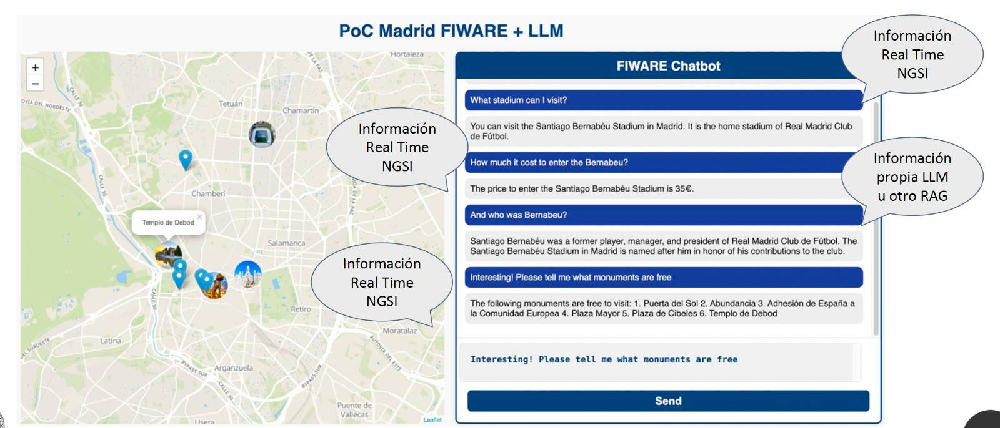

# Poc_LLM_CB_FIWARE

## Deployment 

### Download the Madrid map

Download and unzip Madrid Map from this link: [Madrid Map](https://drive.upm.es/s/KwIzcJl42CTque7) and unzip in `./src/map_madrid` folder

### Serve the map

```
cd src/map_madrid
docker run -it -v $(pwd):/data -p 8080:8080 maptiler/tileserver-gl:v4.6.6 --verbose
``` 
You can access localhost:8080 to see if the map was loaded correctly

### Build the POC
```
cd src
npm install
```
-to build version using openai:
- don't forget to set openai api key in `src/js/thread_openai.mjs` line 7: apiKey: 'TODO_API_KEY', => replace TODO_API_KEY with your openai api key
```
npm run build
```

-to build version using ollama:

- first download & install ollama: https://ollama.com/download
- check ollama is ok: `ollama help`

then:
```
npm run build-local
```
- if you want you can change the model to another one, in ollama.
Open index.html and start playing...

- to avoid CORS issues, using ollama, you need to serve the index.html file from an http-server.
    - install http-server: `npm i -g http-server`
    - start http server from the `src` folder of the project, for example: `http-server -p 80`
    - then open http://localhost:80/index.html or simply http://localhost
    - **need also to add a CORS disabler extension in your browser !**, else it won't works (you'll get error: ```access to fetch at 'http://localhost:11434/v1/chat/completions' from origin 'http://localhost' has been blocked by CORS policy: Request header field access-control-allow-origin is not allowed by Access-Control-Allow-Headers in preflight response.```)

sample questions:
- what to visit regarding sport in Madrid ?

- here is a little screenshot:

