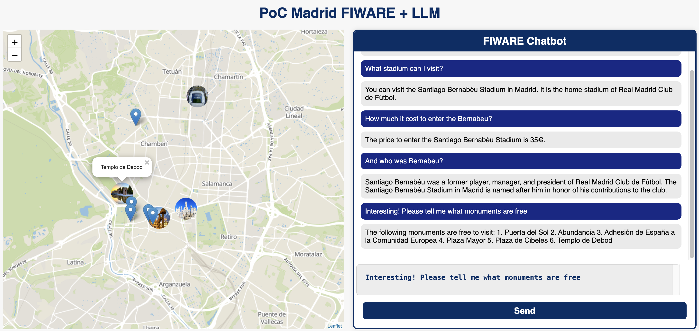

# Deployment 

## Download the Madrid map

Download and unzip Madrid Map from this link: [Madrid Map](https://drive.upm.es/s/KwIzcJl42CTque7) and unzip in map_madrid folder

## Serve the map

```
cd map_madrid
docker run -it -v $(pwd):/data -p 8080:8080 maptiler/tileserver-gl:v4.6.6 --verbose
``` 
You can access localhost:8080 to see if the map was loaded correctly

## Build the POC

TODO: configure your env

```
npm install
npm run build
```

Open index.html and start prompting...

